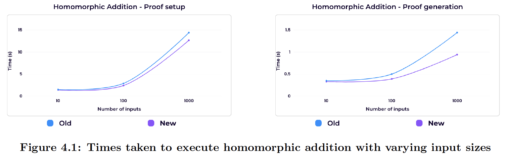
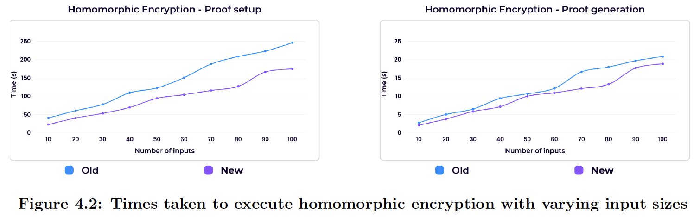
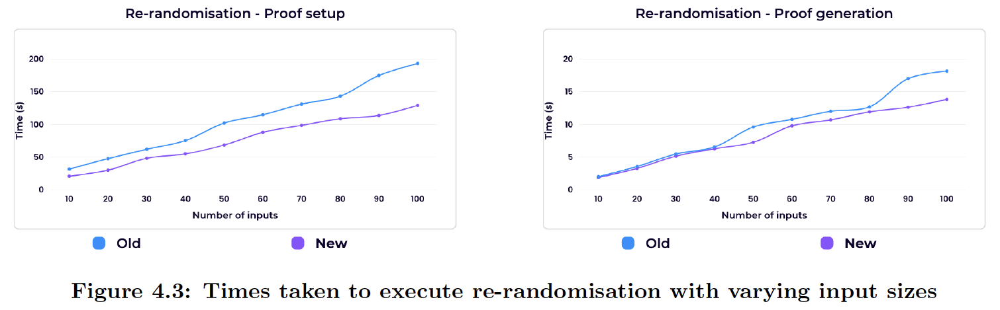

# Exponential elliptic curve ElGamal encyrption circuit implementations in [`Circom`](https://github.com/iden3/circom)

In this repo there are two implementations, `new-implementation` and `previous-implementation`, of common procedures used in exponential elliptic curve ElGamal encryption including homomorphic addition, encryption, re-encryption and re-randomisation.

Along with this, there are circuits pertaining to elliptic curve scalar multiplication for both a pre-chosen generator and arbitrary on-curve points. These differ by implementation. In `new-implementation/single-circuits` these are given by `doubleAndAddGenerator.circom` and `doubleAndAddAny.circom` and in `previous-implementation/single-circuits` these are given by `escalarmulfix.circom` and `escalarmulany.circom`.

## Dependencies  

To be able to compile and run [`Circom`](https://github.com/iden3/circom) circuits see https://docs.circom.io/getting-started/installation/.

## How to run an individual circuit

All invidual circuits are found in the `single-circuits` directory of either implementation's directory and are run in the same way. By example, to run the `new-implementation/single-circuits/doubleAndAddAny.circom` circuit with `new-implementation/single-circuits-inputs/doubleAndAddAny-input.json` as input:
- in `new-implementation/runSingleCircuit.sh`, change line 2 to `circuit='doubleAndAddAny'` and line 3 to `input='doubleAndAddAny-input'`
- in `new-implementation/single-circuits/doubleAndAddAny.circom`, add `component main = doubleAndAddAny()` to the final line
- in a terminal, run `sh new-implementation/runSingleCircuit.sh`

## Benchmarking a multi-input circuit

To time a circuit with multiple inputs, use the `averageTimes` function in `benchmarkMultCircuit.ts` and do the following:
- The first input of `averageTimes` is the circuit's file name.
- The second input is the name of the desired input JSON file.
- The third input is the desired powers of tau file. Pick the powers of tau folder that is best-suited for the number of non-linear constraints produced by the given circuit, a table to help with this is given in https://github.com/iden3/snarkjs/blob/master/README.md. For example, if a circuit produces 15000 constraints then one should use `powersOfTau28_hez_final_14.ptau` as it allows for the proof completion of any circuit that produces less than or equal to 16000 non-linear constraints.
- The fourth input is the proof scheme used, either groth16 or plonk.
-  The fifth input is an integer n corresponding to the number of times the circuit is executed, with the returned time being the average of these n executions.
- Run the typescript file.

For example, if you would like to get the average time of running homomorphic encryption with 100 inputs 5 times using the groth16 proof scheme in the new implementation then add `averageTimes('homEncMult100', 'homEncMult100-input', 'powersOfTau28_hez_final_19', 'groth16', 5);` to the bottom of `new-implementation/benchmarkMultCircuits.ts` and run the script.